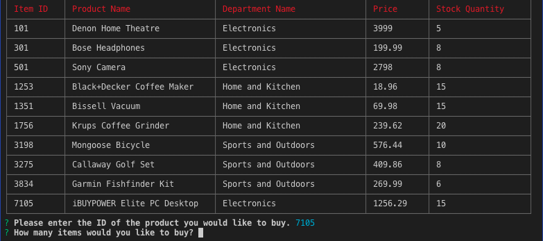

# NodeJS-MySQL

## This is an Amazon-like storefront using NodeJS and MySQL. The app will take in orders from customers and deplete stock from the store's inventory.

### Challenge #1: Customer View

The app prompts users with two messages:

- The first asks them the ID of the product they would like to buy.
- The second message asks how many units of the product they would like to buy.

Once the customer has placed the order, the application checks if the store has enough of the product to meet the customer's request.
If not, the app should log a phrase like Insufficient quantity!, and then prevent the order from going through.
However, if the store does have enough of the product, the customer's order will be fulfilled.
This means updating the SQL database to reflect the remaining quantity.
Once the update goes through, the app will show the customer the total cost of their purchase.

